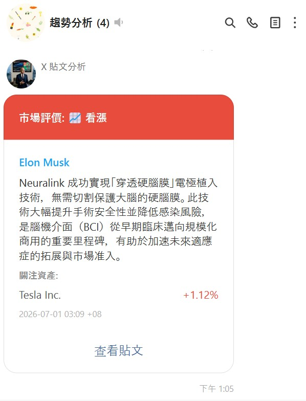

# X Market Analysis

監控 X（Twitter）關鍵人物的貼文，透過 AI 分析市場影響，並即時推送 LINE 通知。



## 架構

```
X (Twitter)
    │
    ▼
XFetcherService          # 定時爬取帳號 / 關鍵字 / hashtag
    │ SQLiteQueue
    ▼
AnalysisEngine           # DeepAgent LLM 分析情緒與受影響資產
    │
    ├─► AlertRuleEngine  # 評分過濾 + flood control → LINE 即時通知
    ├─► SQLiteRepository # 永久儲存貼文 / 分析 / 通知紀錄
    └─► SchedulerEngine  # 每日定時產生市場報告 → LINE 推送
```

## 快速開始

### 1. 安裝依賴

```bash
pip install -r requirements.txt
playwright install chromium
```

### 2. 設定環境變數

```bash
cp .env.example .env
# 編輯 .env，填入 API keys 與監控清單
```

必填項目：

| 變數 | 說明 |
|------|------|
| `GOOGLE_API_KEY` | Google AI Studio API Key（Gemini） |
| `LINE_CHANNEL_ACCESS_TOKEN` | LINE Messaging API Channel Token |
| `LINE_GROUP_IDS` | JSON 格式群組 ID，如 `{"stock":"C_xxx"}` |
| `WATCH_ACCOUNTS` | 監控帳號列表，如 `["elonmusk","federalreserve"]` |

### 3. 啟動

```bash
python -m src.main
```

## 設定說明

| 變數 | 預設值 | 說明 |
|------|--------|------|
| `POLL_INTERVAL_SEC` | `600` | 爬取間隔（秒） |
| `FETCH_LOOKBACK_HOURS` | `24` | 首次啟動回溯小時數 |
| `DAILY_REPORT_TIME` | `10:00` | 每日報告發送時間（UTC） |
| `SCORE_FILTER_ENABLED` | `false` | 僅推送高影響力貼文 |
| `FLOOD_CONTROL_ENABLED` | `false` | 防重複推送 |
| `FLOOD_MIN_POSTS` | `3` | 同作者推送幾筆後啟動 flood control |
| `FLOOD_COOLDOWN_SEC` | `1800` | Flood control 冷卻秒數 |
| `SCRAPER_MAX_WORKERS` | `2` | 並行爬取數（XPublicScraper） |
| `LLM_FAST_MODEL` | `google_genai:gemini-3.1-flash-lite` | 即時分析模型 |
| `LLM_SLOW_MODEL` | `google_genai:gemini-3.1-flash-lite` | 每日報告模型 |
| `SQLITE_DIR` | `data` | SQLite 資料庫目錄（檔名固定為 `xmarket.db`，目錄不存在會自動建立） |
| `PLAYWRIGHT_HEADLESS` | `true` | 是否無頭模式 |

## X 登入（選用）

有 `auth_state.json` 時使用已登入的爬蟲（可存取更多內容），否則自動切換為公開爬蟲。

```bash
python scripts/x_login.py
# 瀏覽器開啟後手動登入，完成後按 Enter
# session 儲存至 auth_state.json
```

自訂輸出路徑：

```bash
python scripts/x_login.py --output auth_state.json
```

## 測試

```bash
python -m pytest tests/ -q
```

## 目錄結構

```
src/
├── agents/          # DeepAgent 定義（analysis_agent, report_agent）
├── clients/         # 外部 API（X scraper, Gemini LLM, LINE, MarketData）
├── db/              # SQLiteRepository
├── models/          # 資料模型（XPost, Analysis, AlertRule...）
├── msgqueue/        # SQLiteQueue / MemoryQueue
├── services/        # 核心服務（Fetcher, AnalysisEngine, AlertEngine, Scheduler）
├── bootstrap.py     # 從環境變數建構 WatchList / AlertRules
├── health.py        # 健康檢查
└── main.py          # 入口
config/
└── settings.py      # 所有環境變數設定
tests/               # 單元測試
```
